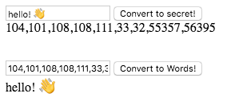

# Code Maker & Breaker

You have been tasked to make an app that will take text and encode it into a secret. 
Your app should also be able to decode secrets that are entered. In the end, you will have something like:

Resources
- Docs on an alternative way [to loop](https://developer.mozilla.org/en-US/docs/Web/JavaScript/Reference/Global_Objects/Array/forEach)
- Docs on [encoding text to UTF-12](https://developer.mozilla.org/en-US/docs/Web/JavaScript/Reference/Global_Objects/String/charCodeAt)
- Docs on [decoding text from UTF-12](https://developer.mozilla.org/en-US/docs/Web/JavaScript/Reference/Global_Objects/String/fromCharCode)
