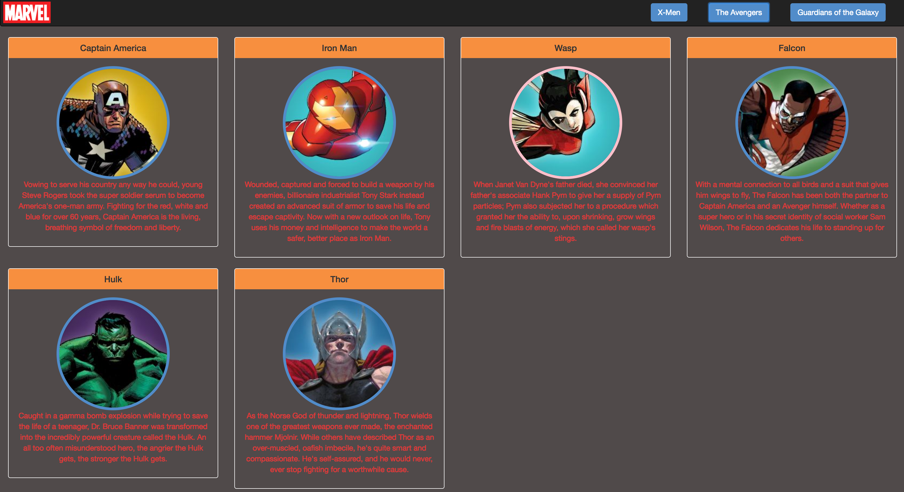

# Marvel Characters

## Introduction

## Planning Requirements
* Create a new github repo called `marvel-characters`
* Create a github project on this repo
* Create feature tickets for this assignment
* Create wireframes for this project and attach them to the appropriate project.

## Technical Requirements
* You must use [Boostrap 4](https://getbootstrap.com/docs/4.0/getting-started/introduction/) to style your page components.
* Your JS file should be comprised of functions, no actions should happen in your code outside of a function
* Your HTML and JS should all have proper indentations
* You should be using [webpack](https://github.com/nss-nightclass-projects/Night-Class-Resources/blob/master/book-2-patterns-and-tools/chapters/task-runners.md) to compile your JS and SCSS
* You should be writing all your CSS/SCSS in SCSS files
* Your JS code should be eslint error and warning free

## Style requirements
1. Each character should be displayed in a bootstrap card
2. Each character's image should be a circle and have a border color of:
	* Blue if the character is Male
	* Pink if the character is Female
3. There should be 4 cards in each row
4. The Marvel Hex colors are:
	* Red = #e23636
	* Black = #000000
	* Gray = #504a4a
	* Blue = #518cca
	* Orange = #f78f3f

## Data requirements
* Take the included [data files](./data) and place them in your project here: `src/javascripts/helpers/data`
* You can't modify ANY of the arrays in the data files.
* All interactions with the arrays must happen through get and set methods.  These methods (functions) can be added added to the appropriate data file.

## Requirements
### On page Load
1. There should be a bootstrap navbar
	* Should have [marvel logo](./images/marvel_logo.png) for brand
	* Should be a button for each team in the teams.js file (go ahead and hard code these for now - if you have extra time see if you can add them dynamically)
2. There should be a large Marvel logo

The final result should look like this:

### On click of navbar link
1. The large Marvel logo should go away
2. The appropriate characters should display depending on which button you click on
3. If there is no description for a character (ie description is "") your code should change the description as follows:
	* A female character with no description should get a description of "abcde fghij klmno pqrst uvwxy z"
	* A male character with no description should get a description of "1234567890"

The final result should look something like this:

