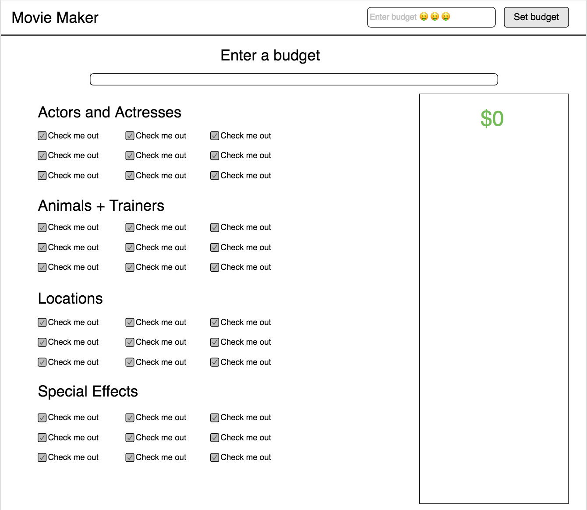
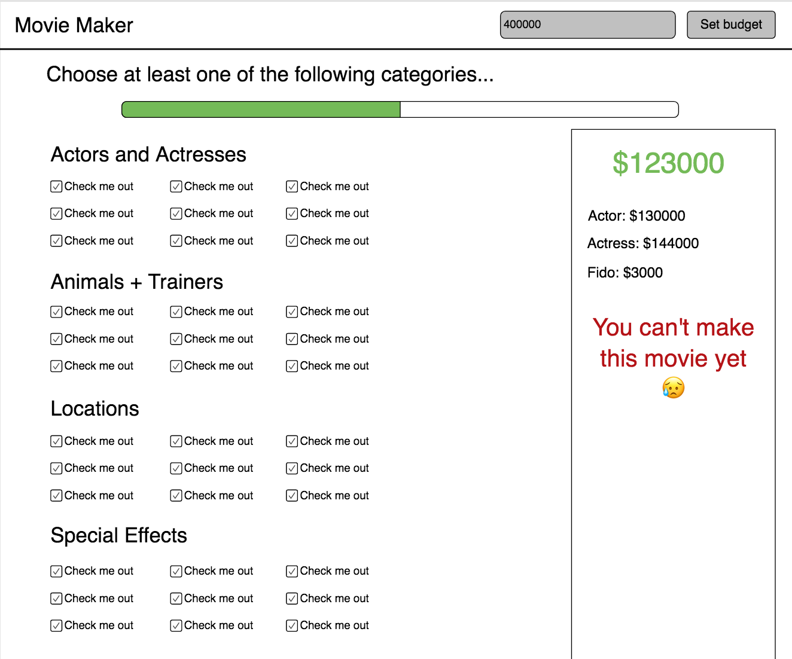
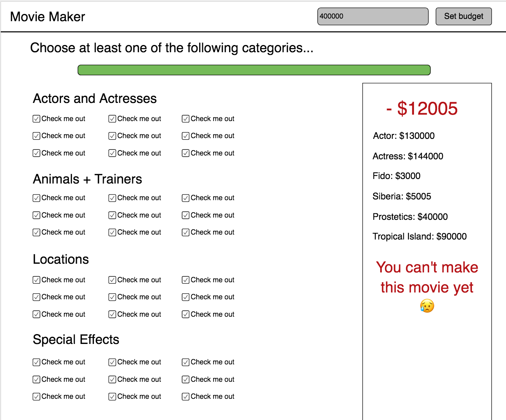
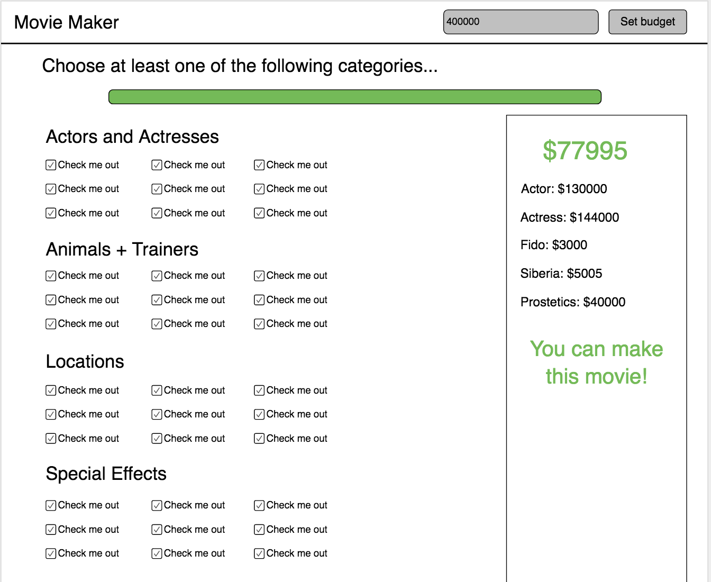

# Movie Maker

## Setup
1. Create a new repository on GitHub
1. Connect the repository with a directory in modern-js/exercises
1. Create a GitHub project and thoroughly plan out the project, breaking it into well-documented tickets.
1. After pushing your base README.md to master, you should be working off branches
1. Create an index.html, main.js and main.css and link them all together.

## Technical Requirements
1. Single responsibility prinicple: Each function should be responsible for one thing.
1. Use browserify and create a separate module for your event listeners and xhr.
1. Data Requirements:
    1. Create a movie-elements.json file. Each file should have _at least_ the following keys:
        - id
        - categoryId
        - name
        - cost
    1. Create a categories.json file with the following keys:
        - id
        - categoryName
    > Your category names should be: 'Actors and Actresses', 'Animals + Trainers', 'Special Effects', and 'Locations'

    > Both the category names and the movie elements should be dynamically populated to the page from the xhr data.
  1. You should use getter and setter functions when applicable.
1. Use bootstrap (v.3.3.7)

## Requirements
1. As a Movie Producer, I want to be able to use this application to determine if I will be able to make a movie given a certain budget and movie elements of my choosing.
    1. I want there to an input box for me to enter my movie budget. When I click enter or click on a button that says 'Set Budget', then I can start to choose things to add to my movie. After setting a budget, I don't want to be able to change my budget.
        - checkboxes on the page are read-only until a budget is set
    1. I want to be able to see all of the things that I can add to my movie at once, but I don't want to see the price of them.
    1. When I add a movie element, my remaining budget should decrease with the cost of the element.
    1. When I add a movie element, the movie element that I added will show up below my remaining budget with the cost of the element.
1. As a Movie Producer, if I still have remaining budget (have not gone over budget) and I have choosen at least one element from each category, then I can make the movie.
    1. When I add the first movie element from a category, the status bar at the top of the page should increase in the right proportion.
    
    1. My remaining budget should be green while the number is positive (I still have remaining budget), but it should be red if the number is negative.
    1. When I add the first movie element from a category, the status bar at the top of the page should increase in the right proportion. Once I have choosen at least one movie element from each category, the status bar will be complete.
    1. If I can't yet make the movie, then there is red text saying that 'I can't make the movie yet' under the added movie elements.
    
    1. If I can make the movie, then there is green text saying that 'I can make the movie' under the added movie elements.

## Bonuses
1. Create an additional set of new movie elements that exist under a new category. Add the new category to your categories.json file. Make sure your application can dynamically deal with this new data.
1. Make it possible for the user to set a new budget. When this happens, the total is recalculated with the their choosen movie elements.
    - 'Set budget' button is changed to 'Change budget' when a budget is set
    - When 'Change budget' is clicked, the input field is cleared out and is no longer read-only. The checkboxes on the page also become read-only but retain their checked values.
1. If the user is over budget (total is negative), and there are specific movie elements could be removed to make the movie within budget, then that movie element is marked in yellow.
